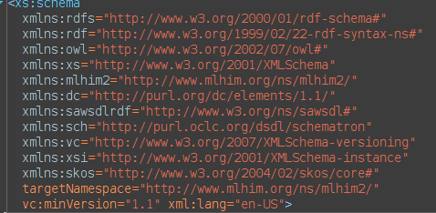

====================
The MLHIM Eco-System
====================

It is important here to describe all of the components of the MLHIM conceptual eco-system in order for the reader to appreciate the scope of MLHIM and the importance of the governance policies. 

The Core
--------

At the base of the MLHIM eco-system is the Reference Model (RM). Though the reference implementation is in XML Schema format, in real world applications a chosen object oriented language will likely be used for implementations. Often, tools are available to automatically generate the reference model classes from the XML Schema. This is the basis for larger MLHIM compliant applications. We will later cover implementation options for smaller applications such as mHealth (apps for smartphones and tablets, as well as purpose specific devices such as a home blood pressure monitor). 

The next level of the MLHIM hierarchy is the Concept Constraint Definition (CCD). The CCD is a set of constraints against the RM that *narrow* the valid data options to a point where they can represent a specific healthcare concept. The CCD is essentially an XML Schema that uses the RM complex types as base types. This is conceptually equivalent to inheritance in object oriented applications, represented in XML Schema.  

Key to Interoperability
-----------------------

Since a CCD (by definition) *can only narrow the constraints* of the RM, then any data instance that is compliant with a CCD is also compliant in any software application that implements the RM or is designed to validate against the RM. Even if the CCD is not available, an application can know how to display and even analyze certain information. For example, if a receiving application does not have a CCD for a given data instance it will be able to discern the CCD ID and RM version from the element name and attributes of the root element. It may or may not be able to retrieve the CCD from the xsi:schemaLocation attribute. If not, it will still be able to infer, based on the reference model version, information about the data by using the names of elements nested within an element with the prefix 'el-'. Because these element names are unique to certain RM complexTypes. If there is a <dvcount-value> element then that data is from a DvCountType and *name* is in the preceding <data-name>. 

Model Publication
-----------------

We are not implying that all CCDs must be publicly available. It is possible to maintain a set of CCDs within a certain political jurisdiction or within a certain professional sector or in a company. How and where these CCDs are maintained are outside the scope of these specifications. Developers proficient in XML technologies will understand how this fits into their application environment and how to use XML Catalogs to reference any local copy. 

Bottom Up vs. Top Down
----------------------

This is now the point where the MLHIM eco-system is in contrast to the top-down approach used by other multi-level modeling specifications. 

*In the real world*; we know that there can never be complete consensus across the healthcare spectrum of domains, cultures and languages; concerning the details of a specific concept. Therefore the concept of a *maximal data model*, though idealistically valid, is realistically unattainable. Several years of participation in and observation of these attempts to build consensus has led to the development of the `Cavalini-Cook Theory <https://github.com/mlhim/specs/wiki/Cavalini-Cook-Conjecture-&-Theory>`_ - **The probability of reaching consensus among biomedical experts tends to zero with the increase of the number of concepts considered and the number of experts included in the consensus panel.**

In MLHIM, participants at any level are encouraged to create domain knowledge models that *fit their needs*. The RM has very little semantic context in it to get in the way. This allows structures to be created as the modeler sees fit for purpose. The Cluster complexType allows for any data structure [#f1]_ to be built to match implementation needs. There is no inherent idea of a specific application such as an Electronic Health Record (EHR), Electronic Medical Record (EMR), etc. in the RM although the MLHIM specifications can also be adopted for the development of these types of applications. This approach provides an opportunity for development of small, purpose specific apps such as mobile or portable device software as well.

How Many CCDs?
--------------
In MLHIM, the bottom-up approach makes room for dozens, hundreds or even thousands of CCDs to describe each healthcare concept, (e.g. blood pressure, body temperature, problem list, medication list, Glasgow Coma Scale, cost of a medical procedure, or any other healthcare phenomena) vs. the top-down approach that requires a single, flat model implemented in software that must encompass all descriptions/uses/etc. This multiplicity of compatible domain knowledge models is achieved by the way CCDs are uniquely identified by a Version 4 Universal Unique Identifier (UUID)2 prefixed with 'ccd-'. CCDs are assembled out of pluggable complexTypes (PcTs) so that modelers can use granular definitions to create any size application model or models, as needed. Modelers and developers can create systems that allow users to choose between a selection of CCDs to include at specific points, at run-time. Reuse of existing PcTs in multiple CCDs and reusing CCDs across multiple applications makes data sharing and analysis easier. However, given that the semantics are in the CCD, data consumers can decide if the data fits their needs or how to include certain components (PcT based data) from multiple CCDs.

With MLHIM CCDs you can deliver your data with complete syntactic interoperability and as much semantic interoperability and information exchange as the modeler chose to include in the CCD. 
The governance of CCDs is left to the modeler and/or publishing organization. 

**There are very strict guidelines that define what constitutes a valid CCD, as seen above.**

A Valid CCD Must:
-----------------
* Be a valid XML Schema 1.1 schema as determined by widely available parser/validators such as `Xerces <http://xerces.apache.org/xerces2-j/faq-xs.html#faq-2>`_ or `Saxon <http://www.saxonica.com/documentation/schema-processing/>`_ 
* Consist of complexTypes that only use the *restriction* element of complexTypes with a *base* attribute from the associated reference model
* use Type 4 UUIDs for complexType names, with the prefix of, 'ct-'. Example [#f2]_ ::
 
    <xs:complexType name='ct-8c177dbd-c25e-4908-bffa-cdcb5c0e38e6' xml:lang='en-US'>

* publish a global element for each complexType where a substitutionGroup is required [#f3]_. The element **MUST** be defined using the same UUID as the complexType with the 'ct-' prefix replaced with 'el-'.
* Include the reference model schema from www.mlhim.org using the appropriately defined namespace. Example for release 2.4.7 and later releases, MLHIM uses the namespace http://www.mlhim.org/xmlns/mlhim2 with the standard prefix of mlhim2 [#f4]_ ::

  <xs:element name='el-8c177dbd-c25e-4908-bffa-cdcb5c0e3888' substitutionGroup='mlhim2:DvAdapter-value' type='mlhim2:ct-8c177dbd-c25e-4908-bffa-cdcb5c0e3888'/>

* use the correct substitution group(s) as in the example above
* define the required namespaces used in the CCD as in Figure 1.
* define the minimum `DCMI <http://dublincore.org/>`_ metadata items as shown in Figure 2.

Figure 1.

.. image:: ccd_metadata.png

Figure 2.

A Valid CCD Must Not:
---------------------
* Contain any other language processing instructions required for validating instance data. For example; Schematron rules. While Schematron can be very valuable in some processing environments it is considered implementation specific and not part of the MLHIM interoperability framework. 
* Import or include any XML Schema document other than its parent reference model schema.

CCD Functionality
-----------------

---------
Structure
---------
A CCD is just an XML Schema. It uses the xs:include element to reference the RM schema from the MLHIM website. For performance a local copy should be used via an `XML Catalog <https://www.oasis-open.org/standards#xmlcatalogsv1.1>`_ 
The design of CCDs allows us to separate the structure from the domain semantics of a complexType. This is key in having a small RM that represents structural components that provide a well defined data query platform which is essential for analytics and decision support. 

Prior to XML Schema 1.1, other languages (such as `Schematron <http://www.schematron.com/>`_ ) were *needed* to provide for complex validation scenarios. The `xs:assert element <http://www.w3.org/TR/xmlschema11-1/#cAssertions>`_ now takes care of those issues. This in addition to gaining additional data model types and the ability to use multiple substitutionGroups is why we specify XML Schema 1.1 as a requirement for CCDs.  

Schematron may still be useful for defining business rules in your implementation. But these definitions are implementation specific and do not apply to the MLHIM semantic interoperability goals. Experience shows that these implementation details *leaked* into the data structure definition creates a barrier to interoperability. 

The use of UUIDs has been controversial and is a perceived barrier by some people. In reality though they are what allows MLHIM to be such a simple, yet powerful solution. This is how we separate the structure and domain semantics. By using UUIDs for the complexType and element names we build a structure that has only *structural semantics*. As an example take a look at `HL7 <http://www.hl7.org/>`_ CDA or FHIR schemas or `NIEM <https://www.niem.gov>`_ schemas. Notice how they mix domain semantics into the names of complexTypes and elements. This creates a nasty chain of optional domain elements because you cannot know a priori what is going to be needed where.  There is an attempt to use attributes to provide some uniqueness to types of entries. But this has grow out of control to a point where those schemas are very complex. NIEM attempted to solve the problem by using a multi-level model approach.  But then *specified* that domain element names **MUST** be terms from the Oxford English Dictionary. So that limits its usefulness to 5.4% of the global population.  To be fair, NIEM is designed and named to be used in the US.  But that is a bit of a short-sighted development approach considering the global world we live in today. 

In designing MLHIM we had the advantage of being able to analyze HL7 v3.x, openEHR, ISO 13606 and other interoperability attempts and use these as lessons learned points. NIEM was started about the same time as MLHIM. 

We realized that this mix of structure and domain semantics was a key problem in the complexity of the models. In openEHR the focus is specifically about EHR systems but it introduced multi-level modeling as a constraint based approach. MLHIM takes the constraint based, multi-level  approach along with the data package view. We say data package because you may view a data instance as a message or as a document *or* as a component of a message or a document. A *MLHIM data instance* is just that. They can be very small or very large and they can be combined into documents or messages or standalone; depending upon the implementation needs. This is part of the *multi-level paradigm*. 

The need for multiple substitutionGroups arises because, one PcT may be reused in multiple places in a CCD. For example a DvLinkType based PcT may be reused as a link in an EntryType as well as used in a ClusterType based PcT.  In this case the since *element* of type *complexType* must be defined as substituting for the RM elements *DvLink* and *DvAdapter-value* elements from the RM.  Example::

      <xs:element name='el-a05e8d88-a6dc-43d5-b1b8-723cdc9bf680' substitutionGroup="mlhim2:DvLink mlhim2:DvAdapter-value" type='mlhim2:ct-a05e8d88-a6dc-43d5-b1b8-723cdc9bf680'/>

---------
Semantics
---------
With the reusability and structural simplicity out of the way we can now discuss the issue of **what does the data mean?**

**NOTE: This section is in active transition from RDF Semantics to OWL2 DL using the RL Profile.**

If you are not familiar with RDF you may want to read more at `LinkedDataTools <http://www.linkeddatatools.com/>`_ or directly from the `W3C Specifications <http://www.w3.org/TR/rdf11-primer/>`_. 

The world of data exchange is composed of two primary players; *data providers* and *data consumers*. Whether those two parties are people or software applications they require this knowledge to turn *data* into useful *information*. We discussed approaches to transferring this information in the **Semantic Models vs. Semantic Markup** section of *Modeling Concepts*. 

Adding the semantics to the model allows all of the meaning of the data to be in one known location. Each data instance has a pointer to its parent CCD. Example::

    xsi:schemaLocation='http://www.mlhim.org/xmlns/mlhim2 http://www.ccdgen.com/ccdlib/ccd-00605c3e-cd14-492e-9891-6ad3ad26230e.xsd'>    

this example from a data instance says that the schema in the namespace *http://www.mlhim.org/xmlns/mlhim2* is located on the CCD-Gen and is named *ccd-00605c3e-cd14-492e-9891-6ad3ad26230e.xsd*. Typically CCDs are located locally and an XML Catalog is used to resolve these locations. 

The first part of the semantics describes the model itself. This is accomplished using the DCMI metadata elements. See the example above in Figure 2. 

Taking a *simplistic* example CCD (the sequence of appearance of the complexTypes is not important) we can see a PcT with a DvLinkType restriction::

    <xs:complexType name='ct-a05e8d88-a6dc-43d5-b1b8-723cdc9bf680' xml:lang='en-US'> 
    <xs:annotation>
      <xs:documentation>
        This is a test DvLink used for an example.
      </xs:documentation>
      <xs:appinfo>
        <rdf:Description rdf:about='mlhim2:ct-a05e8d88-a6dc-43d5-b1b8-723cdc9bf680'>
          <rdfs:subClassOf rdf:resource='mlhim2:DvLinkType'/>
          <rdfs:isDefinedBy rdf:resource='http://www.mlhim.org/generic_pcts'/>
          <rdfs:label>Test DvLink</rdfs:label>
        </rdf:Description>
      </xs:appinfo>
    </xs:annotation>
    <xs:complexContent>
      <xs:restriction base='mlhim2:DvLinkType'>
        <xs:sequence>
          <xs:element maxOccurs='1' minOccurs='1' name='data-name' type='xs:string' fixed="Test DvLink"/>

        ...
    </xs:complexType>

Notice that inside the xs:annotation there are two child elements; xs:documentation and xs:appinfo.  The xs:documentation element has a free text, human readable description of the purpose of the PcT. The xs:annotation element has a child element rdf:Description this element has an rdf:about attribute with a value of the namespace and the complexType name. This forms the *Subject* component of the RDF statements to follow. 

The first child of rdf:Description is a rdfs:subClassOf element. This element name is the *Predicate* component of the first RDF statement. This element has an attribute of rdf:resource and a URI of mlhim2:DvLinkType which forms the *Object* component of this RDF statement. 

The second child of rdf:Description is a rdfs:isDefinedBy element. This element name is the *Predicate* component of the second RDF statement about the PcT. The rdf:resource attribute 
points to a resource on the MLHIM website. `Give it a try <http://www.mlhim.org/generic_pcts>`_. It is just a simple plain text document used as a resource for these examples. Note that it is not a requirement that all URI resources be resolvable URLs. But we think it is a good idea that they are whenever possible. 

The third child of rdf:Description is a rdfs:label This element defines a fixed text label to this PcT. So the *Predicate* is rdfs:label and the *Object* is the string "Test DvLink".

So now we have three statements about the unique subject called *mlhim2:ct-a05e8d88-a6dc-43d5-b1b8-723cdc9bf680*. We know it is a subtype of the MLHIM DvLinkType that is defined in the MLHIM Reference Model schema that is included (via xs:include) in this CCD. We can also find a definition of this PcT in the resource at http://www.mlhim.org/generic_pcts. 

So now we have some machine processable semantics as well as some documentation. All available from the model. Also note that there is the *data-name* element. When a modeler defines a PcT they give it a fixed name as a human readable string. This is included in the data instance and even though the XML element is a UUID, this readable text is immediately below it and describes what the modeler defined for the name. The rdfs:label and the data-name **SHOULD** be the same string. 

Example from the instance data::
 
    <mlhim2:el-c05e8d88-a6dc-43d5-b1b8-723cdc9bf680>
      <data-name>Test DvLink</data-name>
      ...
    </mlhim2:el-c05e8d88-a6dc-43d5-b1b8-723cdc9bf680>  

The next section describes how all of this can be used in an operational setting.

------------------
MLHIM in Operation
------------------
We have a Reference Model, a Concept Constraint Definition and some data instances; all in XML. How does all of that fit together, especially since I use JSON with my REST Services and Turtle for my RDF semantics syntax? 

Glad you asked .... 

Remember that the XML and RDF/XML syntaxes are used because they are robust. They are the canonical definitions for the models and the data because the tools are available for validating the syntax and the semantics. 

Because MLHIM XML data has a *very specific structure* it is quite easy to perform lossless conversion to and from JSON. So you can send and receive JSON data. The points in your data chain that need require validated data can be converted back to XML for validation.  

So (a snippet) like this::

            <mlhim2:el-d4079097-c68b-4c99-9a5e-b85628d55897>
          <!-- Party -->
          <party-name>A. Sample Name</party-name>
          <!-- PI external-ref -->
          <mlhim2:el-ab51a8c0-ba5c-4053-8201-ae29c1a534bb>
            <!-- DvURI -->
            <data-name>External Reference for Party</data-name>
            <!-- Use any subtype of ExceptionalValue here when a value is missing-->
            <valid-time-begin>2006-04-15T04:18:21Z</valid-time-begin>
            <valid-time-end>1981-12-10T19:35:00Z</valid-time-end>
            <DvURI-dv>http://www.ccdgen.com</DvURI-dv>
            <relation>Party Associated with the record</relation>
          </mlhim2:el-ab51a8c0-ba5c-4053-8201-ae29c1a534bb>

can be converted to::

              },
          "mlhim2:el-d4079097-c68b-4c99-9a5e-b85628d55897": {
            "party-name": "A. Sample Name",
            "mlhim2:el-ab51a8c0-ba5c-4053-8201-ae29c1a534bb": {
              "data-name": "External Reference for Party",
              "valid-time-begin": "2006-04-15T04:18:21Z",
              "valid-time-end": "1981-12-10T19:35:00Z",
              "DvURI-dv": "http://www.ccdgen.com",
              "relation": "Party Associated with the record"
            },

and back again. All depending upon the needs of your information flow.

Two of the MLHIM projects on GitHub demonstrate combining the model semantics with the data instances to create a Graph and storing it in a Triple Store. The connections can then be visualized using open source tools and / or queried using SPARQL. 

For deeper details on using MLHIM in various scenarios you should refer to the `GitHub repository <https://github.com/mlhim>`_ specifically `this project <https://github.com/mlhim/MLHIM_semantics_extractor>`_ as well as the `MXIC demo <https://github.com/mlhim/mxic>`_ and the `MAPLE demo <https://github.com/mlhim/MAPLE>`_ These all use older versions of MLHIM but the concepts are the same for any 2.x version. 

Two projects that may be of particular interest is `adding semantics to FHIR models <https://github.com/mlhim/ichi2015_fhir_semantics>`_ and `adding semantics to HL7v2 messages <https://github.com/mlhim/hl7v2_semantics>`_

Ontologies
----------
The operational ontologies are a key part of the semantic interoperability schema of MLHIM. 
They link the MLHIM structured (XML) data to Semantic Web / Linked Data tools. 

The mlhim2.owl file contains a core ontology used to build a basis for metadata and other classes and properties not found in existing ontologies and tools.

This core ontology is imported into each reference model ontology.  The reference model ontologies are built using information from the xs:appinfo elements in the reference model schema.  A tool, pyMOE.py can be found in the *utils* folder that extracts this information and builds the RM ontology.  The ontology file carries the same name as the RM schema, just with the extension replaced with '.owl'. It is located in the *ontology* folder along with mlhim2.owl. 

If you want a quick visualization of the ontologies you can use the `WebVOWL <http://vowl.visualdataweb.org/webvowl/index.html>`_ online tool to visualize the `core ontology <http://vowl.visualdataweb.org/webvowl/index.html#iri=https://raw.githubusercontent.com/mlhim/mlhim.github.io/master/mlhim2.owl>`_ and the `MLHIM 2.5.0 ontology <http://vowl.visualdataweb.org/webvowl/index.html#iri=https://raw.githubusercontent.com/mlhim/mlhim.github.io/master/xmlns/mlhim2/mlhim250.owl>`_ .

This 2.5.0 development version still has a few quirks in the way the ontology components are defined. Once these are worked out, a document describing the mapping process will also be part of this documentation. 

The process for CCD ontologies is essentially the same and a tool will also be proveide to build those from the CCD schema xs:appinfo information. 

This approach has been shown to be much more reliable than building an ontology in a separate file. Plus, it makes automated processing quite easy via tools like the CCD-Gen. 

.. rubric:: Footnotes

.. [#f1] Used here to mean; trees, lists, tables, etc.
.. [#f2] The language attribute is optional. 
.. [#f3] Substitution groups are required where the base type allows multiple elements and where the base type allows an abstract element. 
.. [#f4] Some previous releases had a specific namespace for the RM and each CCD. This was changed to a single namespace for all of MLHIM 2.x versions to improve query and processing interoperability. 
