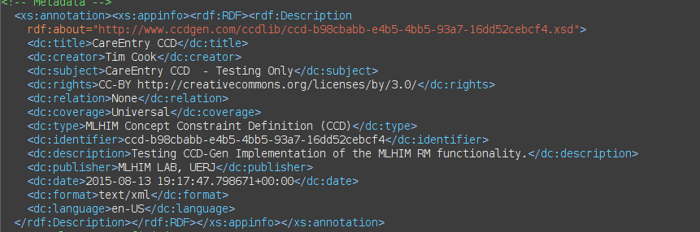

====================
The MLHIM Eco-System
====================

It is important here to describe all of the components of the MLHIM conceptual eco-system in order for the reader to appreciate the scope of MLHIM and the importance of the governance policies. 

The Core
--------

At the base of the MLHIM eco-system is the Reference Model (RM). Though the reference implementation is in XML Schema format, in real world applications a chosen object oriented language will likely be used for implementations. Often, tools are available to automatically generate the reference model classes from the XML Schema. This is the basis for larger MLHIM compliant applications. We will later cover implementation options for smaller applications such as mHealth (apps for smartphones and tablets, as well as purpose specific devices such as a home blood pressure monitor). 

The next level of the MLHIM hierarchy is the Concept Constraint Definition (CCD). The CCD is a set of constraints against the RM that *narrow* the valid data options to a point where they can represent a specific healthcare concept. The CCD is essentially an XML Schema that uses the RM complex types as base types. This is conceptually equivalent to inheritance in object oriented applications, represented in XML Schema.  

Key to Interoperability
-----------------------

Since a CCD (by definition) *can only narrow the constraints* of the RM, then any data instance that is compliant with a CCD is also compliant in any software application that implements the RM or is designed to validate against the RM. Even if the CCD is not available, an application can know how to display and even analyze certain information. For example, if a receiving application does not have a CCD for a given data instance it will be able to discern the CCD ID and RM version from the element name and attributes of the root element. It may or may not be able to retrieve the CCD from the xsi:schemaLocation attribute. If not, it will still be able to infer, based on the reference model version, information about the data by using the names of elements nested within an element with the prefix 'el-'. Because these element names are unique to certain RM complexTypes. If there is a <dvcount-value> element then that data is from a DvCountType and *name* is in the preceding <data-name>. 

Model Publication
-----------------

We are not implying that all CCDs must be publicly available. It is possible to maintain a set of CCDs within a certain political jurisdiction or within a certain professional sector or in a company. How and where these CCDs are maintained are outside the scope of these specifications. Developers proficient in XML technologies will understand how this fits into their application environment and how to use XML Catalogs to reference any local copy. 

Bottom Up vs. Top Down
----------------------

This is now the point where the MLHIM eco-system is in contrast to the top-down approach used by other multi-level modeling specifications. 

*In the real world*; we know that there can never be complete consensus across the healthcare spectrum of domains, cultures and languages; concerning the details of a specific concept. Therefore the concept of a *maximal data model*, though idealistically valid, is realistically unattainable. Several years of participation in and observation of these attempts to build consensus has led to the development of the `Cavalini-Cook Theory <https://github.com/mlhim/specs/wiki/Cavalini-Cook-Conjecture-&-Theory>`_ - **The probability of reaching consensus among biomedical experts tends to zero with the increase of the number of concepts considered and the number of experts included in the consensus panel.**

In MLHIM, participants at any level are encouraged to create domain knowledge models that *fit their needs*. The RM has very little semantic context in it to get in the way. This allows structures to be created as the modeler sees fit for purpose. The Cluster complexType allows for any data structure [#f1]_ to be built to match implementation needs. There is no inherent idea of a specific application such as an Electronic Health Record (EHR), Electronic Medical Record (EMR), etc. in the RM although the MLHIM specifications can also be adopted for the development of these types of applications. This approach provides an opportunity for development of small, purpose specific apps such as mobile or portable device software as well.

How Many CCDs?
--------------
In MLHIM, the bottom-up approach makes room for dozens, hundreds or even thousands of CCDs to describe each healthcare concept, (e.g. blood pressure, body temperature, problem list, medication list, Glasgow Coma Scale, cost of a medical procedure, or any other healthcare phenomena) vs. the top-down approach that requires a single, flat model implemented in software that must encompass all descriptions/uses/etc. This multiplicity of compatible domain knowledge models is achieved by the way CCDs are uniquely identified by a Version 4 Universal Unique Identifier (UUID)2 prefixed with 'ccd-'. CCDs are assembled out of pluggable complexTypes (PcTs) so that modelers can use granular definitions to create any size application model or models, as needed. Modelers and developers can create systems that allow users to choose between a selection of CCDs to include at specific points, at run-time. Reuse of existing PcTs in multiple CCDs and reusing CCDs across multiple applications makes data sharing and analysis easier. However, given that the semantics are in the CCD, data consumers can decide if the data fits their needs or how to include certain components (PcT based data) from multiple CCDs.

With MLHIM CCDs you can deliver your data with complete syntactic interoperability and as much semantic interoperability and information exchange as the modeler chose to include in the CCD. 
The governance of CCDs is left to the modeler and/or publishing organization. 

**There are very strict guidelines that define what constitutes a valid CCD, as seen above.**

A Valid CCD Must:
-----------------
* Be a valid XML Schema 1.1 schema as determined by widely available parser/validators such as `Xerces <http://xerces.apache.org/xerces2-j/faq-xs.html#faq-2>`_ or `Saxon <http://www.saxonica.com/documentation/schema-processing/>`_ 
* Consist of complexTypes that only use the *restriction* element of complexTypes with a *base* attribute from the associated reference model
* use Type 4 UUIDs for complexType names, with the prefix of, 'ct-'. Example [#f2]_ ::
 
    <xs:complexType name='ct-8c177dbd-c25e-4908-bffa-cdcb5c0e38e6' xml:lang='en-US'>

* publish a global element for each complexType with the name defined using the same UUID as the complexType with the 'ct-' prefix replaced with 'el-'.
* Include the reference model schema from www.mlhim.org using the appropriately defined namespace. Example for release 2.4.7 and later releases, MLHIM uses the namespace http://www.mlhim.org/xmlns/mlhim2 with the standard prefix of mlhim2 [#f3]_ ::

  <xs:element name='el-8c177dbd-c25e-4908-bffa-cdcb5c0e3888' substitutionGroup='mlhim2:DvString' type='mlhim2:ct-8c177dbd-c25e-4908-bffa-cdcb5c0e3888'/>

* use the correct substitution group(s) as in the example above
* define the required namespaces used in the CCD as in Figure 1.
* define the minimum DCMI6 metadata items as shown in Figure 2.

.. image:: ccd_header.png

Figure 1.

Figure 2.

A Valid CCD Must Not:
---------------------
* Contain any other language processing instructions required for validating instance data. For example; Schematron rules. While Schematron can be very valuable in some processing environments it is considered implementation specific and not part of the MLHIM interoperability framework. 
* Import or include any XML Schema document other than its parent reference model schema.

.. rubric:: Footnotes

.. [#f1] Used here to mean; trees, lists, tables, etc.
.. [#f2] The language attribute is optional. 
.. [#f3] Some previous releases had a specific namespace for the RM and each CCD. This was changed to a single namespace for all of MLHIM 2.x versions to improve query and processing interoperability. 